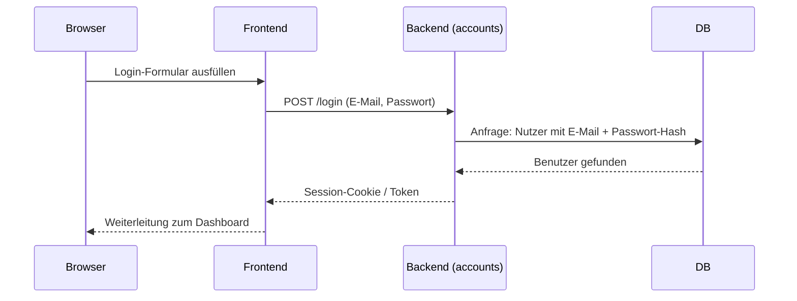
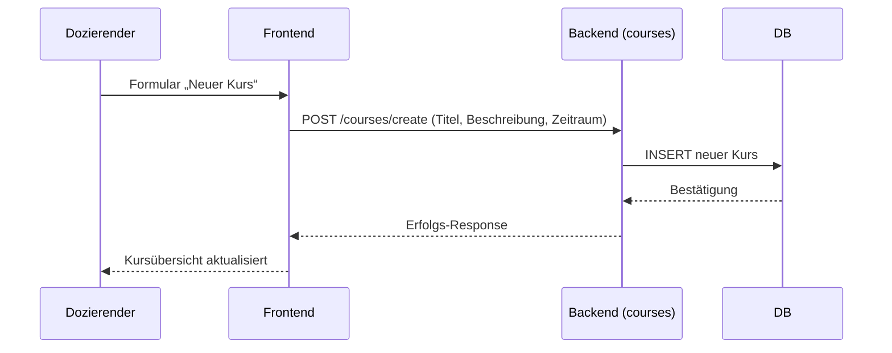
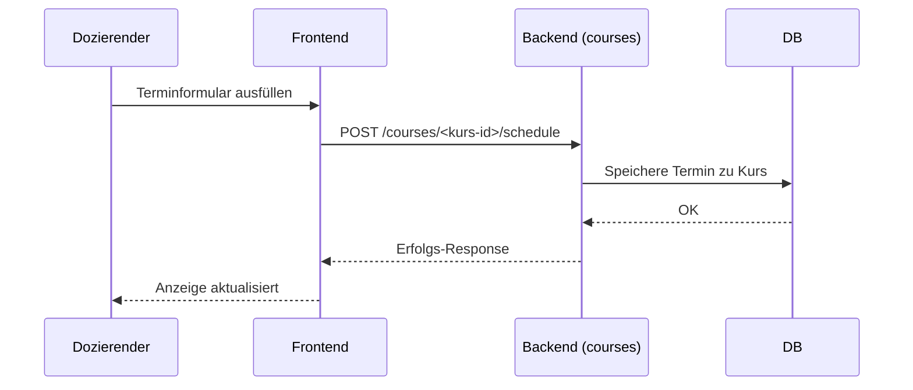
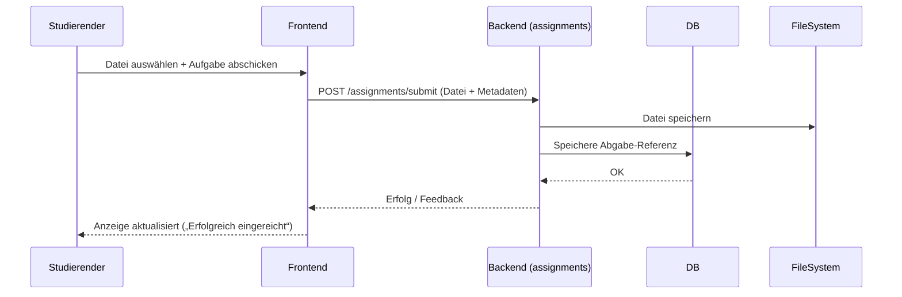
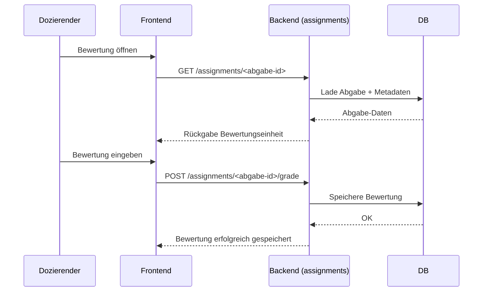

<!---
Artefakte der Systemdokumentation wurden mithilfe von ChatGPT (OpenAI) erstellt und manuell angepasst
-->
# 06 – Laufzeitsicht

Dieses Kapitel zeigt das dynamische Verhalten des Systems anhand exemplarischer Szenarien.

## 1. Login eines Studierenden

Beim Login werden die Zugangsdaten überprüft, ein Token oder Session-Cookie erstellt und der Nutzer weitergeleitet.

## 2. Erstellung von Kursen

## 3. Erstellung von Terminen

## 4. Erstellung von Abgaben

## 5. Korrektur von Abgaben
