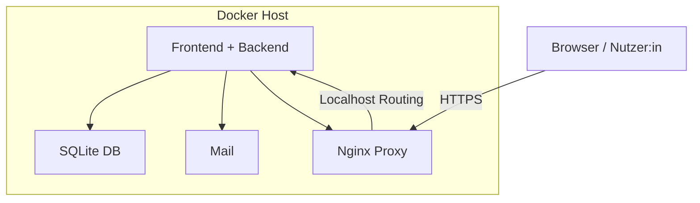

# 07 – Verteilungssicht

Dieses Kapitel beschreibt die physische Verteilung und Deploymentstruktur der Studurizer-Anwendung.

## Übersicht

Studurizer wird containerisiert mit **Docker** ausgeliefert. Alle wesentlichen Komponenten laufen in einem lokalen Docker-Netzwerk.  

Für die Entwicklungsumgebung ist eine **Single-Host-Lösung** vorgesehen. In der Produktion kann das System auf einen Linux-Server mit Reverse-Proxy (z. B. NGINX) ausgerollt werden.

## Laufzeitumgebung (Entwicklung)

| Container        | Funktion                                                    |
|------------------|-------------------------------------------------------------|
| **web**          | Django-Anwendung (Dev-Server)                               |
| **db**           | SQLite-Datei im Container-Dateisystem (persitiert im Volume) |
| **nginx** (optional) | Reverse Proxy für HTTPS/Port-Routing                        |
| **mail** (optional) | Fake-Mailer zum Testen von E-Mails                          |

---

## Verteilungssicht (Mermaid-Diagramm)

