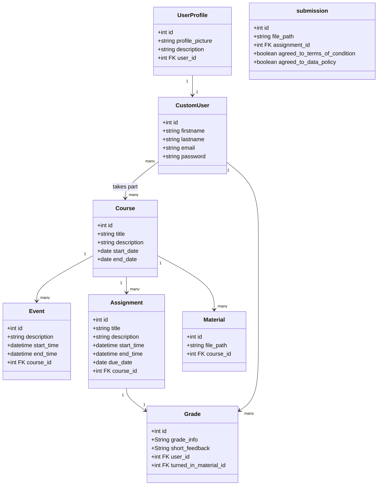

# Datenbankmodell Studurizer

```mermaid 
classDiagram
   class Course {
        +int id
        +string title
        +string description
        +date start_date
        +date end_date
    }

    class CustomUser {
        +int id
        +string firstname
        +string lastname
        +string email
        +string password
    }
    
    class UserProfile {
        +int id
        +string profile_picture
        +string description
        +int FK user_id
    }

   class Event {
        +int id
        +string description
        +datetime start_time
        +datetime end_time
        +int FK course_id
    }

    class Assignment {
        +int id
        +string title
        +string description
        +datetime start_time
        +datetime end_time
        +date due_date
        +int FK course_id
    }

    class Material {
        +int id
        +string file_path
        +int FK course_id
    }

   class submission {
        +int id
        +string file_path
        +int FK assignment_id
        +boolean agreed_to_terms_of_condition
        +boolean agreed_to_data_policy 
    }

    class Grade {
        +int id
        +String grade_info
        +String short_feedback
        +int FK user_id
        +int FK turned_in_material_id
    }
    


    %% Beziehungen
    CustomUser "many" --> "many" Course : takes part
    Course "1" --> "many" Material
    Course "1" --> "many" Assignment
    Course "1" --> "many" Event
    Assignment "1" --> "1" Grade
    CustomUser "1" --> "many" Grade
    UserProfile "1" --> "1" CustomUser
```
